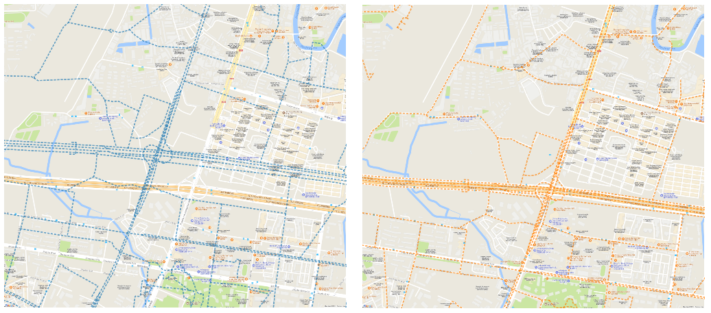

### wgs2gcj

This is a python script for converting GeoJSON file in WGS84 (epsg:4326) coordinate system to the Mars coordinate system (GCJ-02), which is used for encryption of GPS data in China. 

When you download OpenStreetMap data, which is in WGS84 reference, you may encounter a systematic offset of the road network to the GPS observations (left). After transformation, the offset is corrected (right). 

### References

- Eviltransform library https://github.com/googollee/eviltransform

### Contact

Can Yang, Ph.D. student at KTH, Royal Institute of Technology in Sweden

Email: cyang(at)kth.se

Homepage: https://people.kth.se/~cyang/

